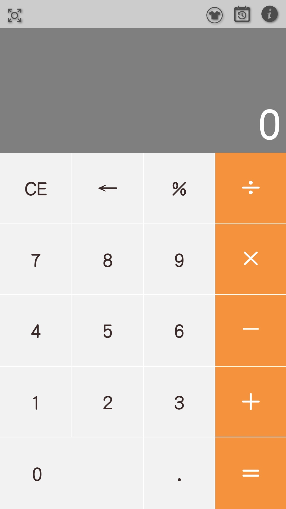
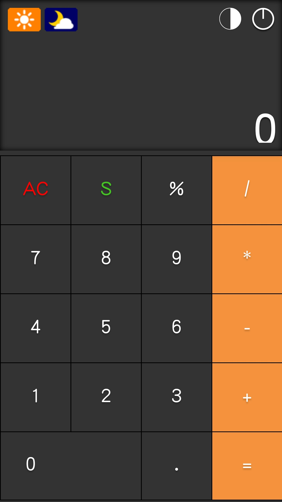
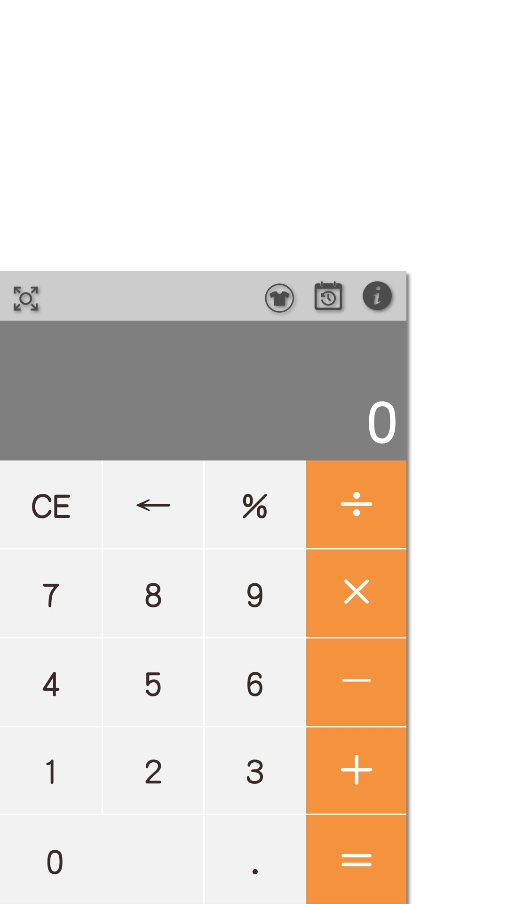
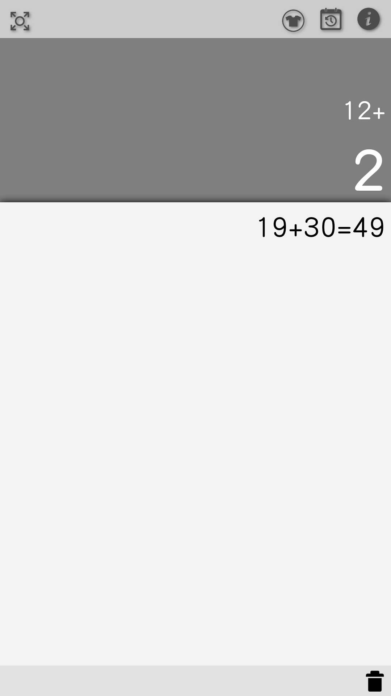
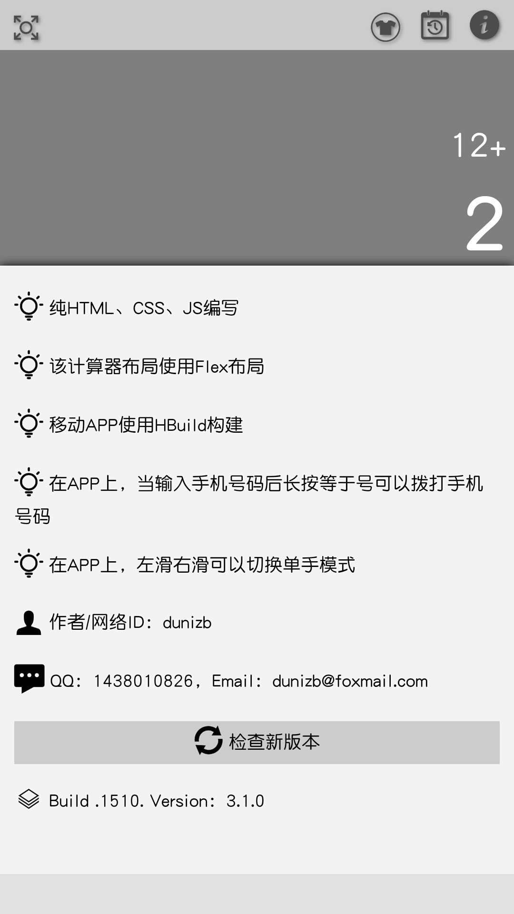
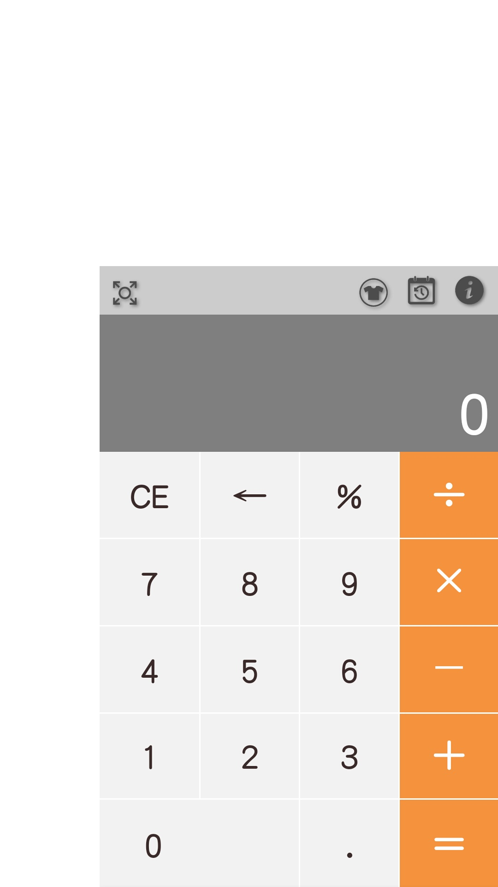

# sCalc

## 功能说明
A simple calculator,一个简易计算器

1. 纯HTML、CSS、JS编写
2. 该计算器布局使用CSS3 FlexBox布局
3. 移动APP使用HBuild构建
4. 在APP上，当输入手机号码后长按等于号可以拨打手机号码
5. 左滑右滑可以切换单手模式
6. 内置两套主题可切换

## 效果图
| 主页1-灰白主题 | 主页2-黑暗主题 | 单手模式（左） |
|-------------|-------------|-------------|
|  |  |  |

| 历史记录页面 | 关于页面 | 单手模式（右） |
|-------------|-------------|---------------|
|  |  |  |

